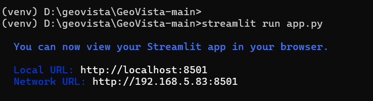
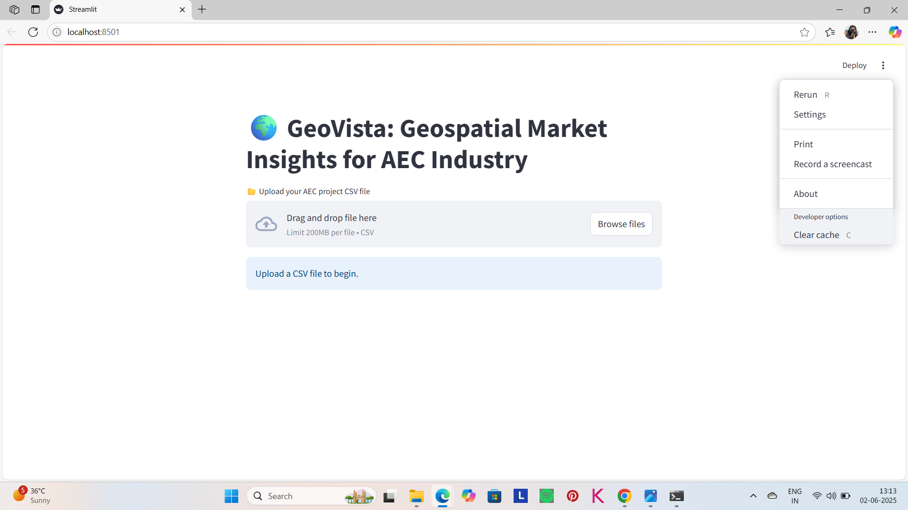
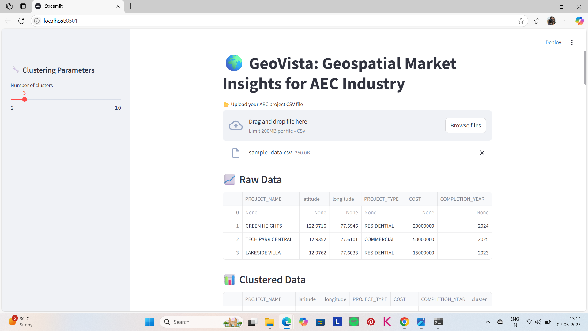
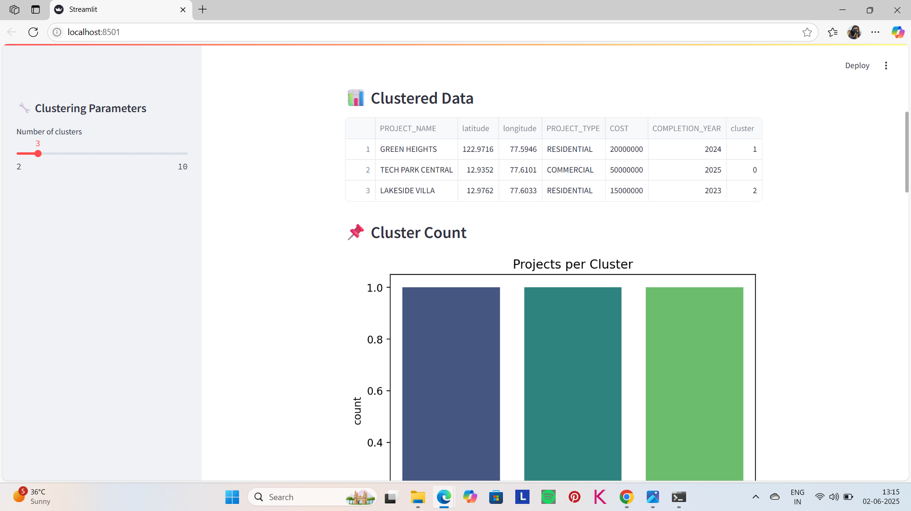
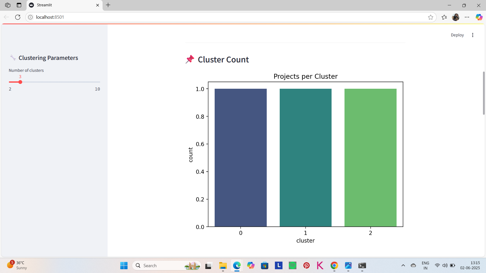
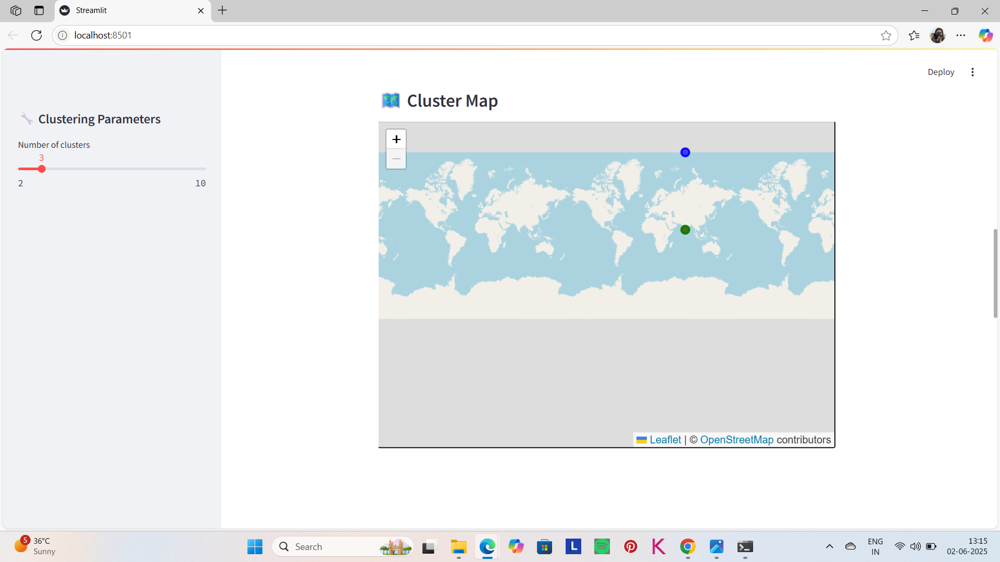

# GeoVista: Geospatial Market Insights for the AEC Industry 🏗️🌍

## 🔍 Problem
AEC industry projects often lack spatial insights to optimize location-based decisions.

## 💡 Solution: GeoVista
GeoVista is an interactive dashboard that allows users to upload project data, analyze clusters, and visualize locations on maps using geospatial techniques.

## 🛠️ Tech Stack
- Python
- Streamlit
- Pandas, GeoPandas
- Scikit-learn
- Folium
- Azure (Web App for deployment, Storage for data)

## 🎯 Who Benefits?
- AEC project planners
- Urban developers
- Real estate analysts

## 🌟 Unique Features
- Easy CSV uploads
- Clustering based on geospatial coordinates
- Interactive map visualizations

## 🚀 Getting Started
1. Install dependencies: `pip install -r requirements.txt`
2. Run with: `streamlit run app.py`

## 📷 Project Visuals

### 💻 Command Line Interface

### 🗺️ Dashboard View

### 📊 Sample Outputs

#### 📌 Sample Output 1

#### 📌 Sample Output 2

#### 📌 Sample Output 3

#### 📌 Sample Output 4

## Acknowledgements

This project was created as part of the Code; Without Barriers Hackathon.

I used ChatGPT to guide me with:
- Structuring the project
- Writing initial Python and Streamlit code
- Debugging common errors
- Improving README documentation

## Disclaimer:
⚠️ **Note**: This project titled “GeoVista” was developed independently as part of the Code; Without Barriers Hackathon. It is not affiliated with or endorsed by any existing company or organization of the same name. The name is used here solely for educational and non-commercial purposes.

## Contributing:
Feel free to fork this repository, make improvements, or suggest new features. Contributions are welcome!

